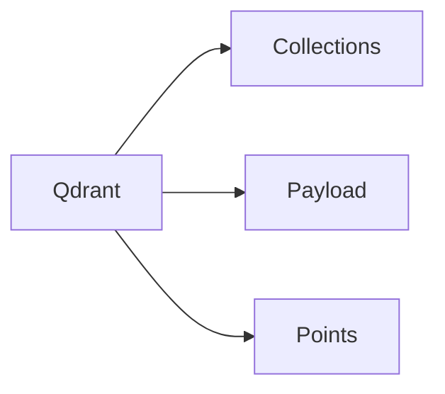

# 写在前面

我们借助 Qdrant 来了解向量数据库的一些内容

# 内容

## 什么是 Qdrant？

Qdrant 是一个开源的针对向量相似性搜索的引擎，它提供了一系列的 API 用于对向量数据进行存储、搜索和管理等功能。

下面是来自 Qdrant 官网的一个架构图：


## 初步了解 Qdrant 里的一些概念

以 Qdrant 的架构图为背景，我们需要初步了解下里面涉及到的一些概念名词，后面我们再对这些概念做进一步的了解。



### Collections

在 Qdrant 里，Point = id + vector + payload。多个 Point + 可搜索的属性，就组成了 Collection。

以下是官方的示例代码：

```python
# create collection
from qdrant_client.models import Distance, VectorParams

client.create_collection(
    collection_name="test_collection",
    vectors_config=VectorParams(size=4, distance=Distance.DOT),
)
```

我们需要先创建一个 Collection，然后指定它的向量配置，例如元素的数量为4，距离算法使用点积算法。

```python
# add vector
from qdrant_client.models import PointStruct

operation_info = client.upsert(
    collection_name="test_collection",
    wait=True,
    points=[
        PointStruct(id=1, vector=[0.05, 0.61, 0.76, 0.74], payload={"city": "Berlin"}),
        PointStruct(id=2, vector=[0.19, 0.81, 0.75, 0.11], payload={"city": "London"}),
    ],
)

print(operation_info)
```

然后我们需要往 Collection 里添加向量数据。一个 Point 里的 payload，其实就是存放一些人类可理解的数据，毕竟如果向量里只有单纯的数字，意义不明。每个Point 都有一个唯一 id。

至于向量里的四个元素的实际意义（这里只是一个示例，没有什么实际意义），在实际的开发过程中，我们会使用一些向量化的工具来帮我们实现，例如在 Langchain 里，我们可能会用到 OpenAIEmbedding 之类的工具帮助我们将文档向量化。 *（可以参考下 [Embedding OpenAI](https://qdrant.tech/documentation/embeddings/openai/)）*

## Payload

上面简单讲了下 Payload 是 Point 里的额外数据补充。在 Qdrant 里，Payload 是一个 JSON 对象，一个典型的 Payload 如下：

```json
{
  "name": "jacket",
  "colors": [
    "red",
    "blue"
  ],
  "count": 10,
  "price": 11.99,
  "locations": [
    {
      "lon": 52.5200,
      "lat": 13.4050
    }
  ],
  "reviews": [
    {
      "user": "alice",
      "score": 4
    },
    {
      "user": "bob",
      "score": 5
    }
  ]
}
```

为了方便查找数据，Qdrant 定义了 Payload 类型，来帮助我们基于这些类型进行搜索。

### Payload 类型

#### Integer

```json
{
  "count": 10,
  "sizes": [
    35,
    36,
    38
  ]
}
```

#### Float
```json
{
  "price": 11.99,
  "sizes": [
    35.5,
    36.5,
    38.5
  ]
}
```
#### Boolean

```json
{
  "is_available": true,
  "sizes": [
    35,
    36,
    38
  ]
}
```

#### Keyword

```json
{
  "name": "jacket",
  "sizes": [
    "S",
    "M",
    "L"
  ]
}
```

#### Geo

```json
{
  "location": {
    "lon": 52.5200,
    "lat": 13.4050
  },
  "cities": [
    {
      "lon": 51.5072,
      "lat": 0.1276
    },
    {
      "lon": 40.7128,
      "lat": 74.0060
    }
  ]
}
```

#### Datetime

Datetime 使用的是 `RFC 3339` 格式

```json
{
  "created_at": "2023-02-08T10:49:00Z",
  "updated_at": [
    "2023-02-08T13:52:00Z",
    "2023-02-21T21:23:00Z"
  ]
}
```

## Points

一个 point 就是由 vector 和 payload（可选的）组成的一条记录。

```json
{
  "id": 129,
  "vector": [
    0.1,
    0.2,
    0.3,
    0.4
  ],
  "payload": {
    "color": "red"
  }
}
```

### Vectors

一个 point 里可能有多个 vector。例如：

```json
{
  "points": [
    {
      "id": 1,
      "vector": {
        "image": [
          0.9,
          0.1,
          0.1,
          0.2
        ],
        "text": [
          0.4,
          0.7,
          0.1,
          0.8,
          0.1,
          0.1,
          0.9,
          0.2
        ]
      }
    },
    {
      "id": 2,
      "vector": {
        "image": [
          0.2,
          0.1,
          0.3,
          0.9
        ],
        "text": [
          0.5,
          0.2,
          0.7,
          0.4,
          0.7,
          0.2,
          0.3,
          0.9
        ]
      }
    }
  ]
}
```

vector 有几种类型：

| 类型                   | 描述                                                 |
|----------------------|----------------------------------------------------|
| Dense Vectors （密集向量） | 这是常规的向量，大多数的 embedding 模型都会生成这种类型                  |
| Sparse Vectors（稀疏向量） | 这是没有固定长度的向量，有少量的非零元素。对于像精准的token匹配，推荐系统里的协同过滤都非常有用 |
| MultiVectors（多向量）    | 长度固定但高度可变的矩阵，在一些新模型如 ColBERT 里会用到                  |

针对`密集向量`和`稀疏向量`，这里简单讲下这两者：
对于密集向量，也就是这个向量里，大部分是有值的，意味着它的信息很丰富，这也是一般的向量形式。对于这种向量，可以用数组形式来保存：[1.0,0.0,1.0,3.0]。

而稀疏向量，意味着里面只有少部分有值，如果也用数组，则会有大量的空间被浪费，所以会设计另外的数据结构来保存，例如：(4,[0,2,3],[1.0,1.0,3.0])，表示这个向量有 4 个元素，然后哪些下标是有值的，且值是多少。

由于稀疏向量有值的部分是很少的，意味着要记录的特征是很明显的，例如一篇文章，如果主题鲜明，我们可以用稀疏向量来记录，那么在查找相关主题的时候，这篇文章就很容易被找到。而如果使用密集向量，这篇文章则可能信息量关于丰富，导致主题过多，而可能没法关联到某个主题上，进而没被检索到。


# 参考
[稠密向量与稀疏向量](https://www.yeahchen.cn/2022/03/13/%E7%A8%A0%E5%AF%86%E5%90%91%E9%87%8F%E4%B8%8E%E7%A8%80%E7%96%8F%E5%90%91%E9%87%8F/)
[详解如何通过稀疏向量优化信息检索](https://www.53ai.com/news/RAG/2024072379623.html)

